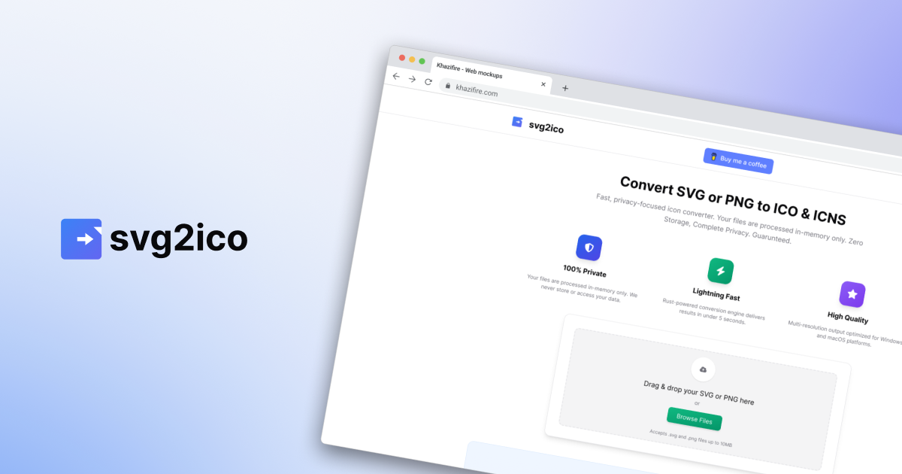

# SVG2ICO

A free online tool for converting SVG and PNG files into platform-specific icon formats. Available at [svg2ico.com](https://svg2ico.com).

## What It Does

SVG2ICO converts your vector graphics and images into ready-to-use icon files:

- **ICO** - Windows icon format with multi-resolution support (16x16 through 256x256)
- **ICNS** - macOS icon format with complete resolution set including Retina @2x variants
- **PNG** - High-quality export with custom sizes from 16x16 to 1024x1024
- **Favicon** - Optimized ICO format for websites
- **Batch Export** - Download ICO + ICNS together as a ZIP

## Features

- **Real-Time Preview** - See your icon in macOS and Windows contexts with dark/light themes
- **Background Removal** - Automatically detect and remove backgrounds, specify a color, or use AI-powered smart removal
- **Customizable Output** - Adjust scale (50-200%) and corner radius (0-50%)
- **Fast Processing** - Rust-powered conversion completes in under 5 seconds
- **PNG Support** - Convert PNG images in addition to SVG files

## Privacy

Your files are processed in-memory only. We never store or access your uploaded content. Files are processed and immediately discarded.

## Limitations

- Maximum file size: 10MB
- One file at a time

## Tech Stack

- **Frontend**: React, TypeScript, Tailwind CSS, shadcn/ui
- **Backend**: NestJS, Prisma, PostgreSQL
- **Image Processing**: Resvg (Rust-powered SVG rendering), Sharp
- **Infrastructure**: Turborepo monorepo

## Self-Hosting

Want to run your own instance? See [CLAUDE.md](CLAUDE.md) for development setup instructions.

## License

BSL 1.1
