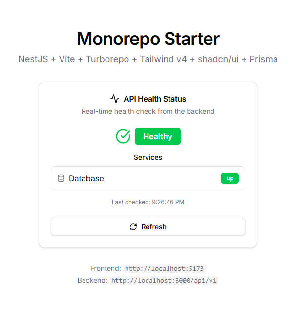

# SVG2ICO

A web-based SVG to icon converter that transforms SVG files into platform-specific icon formats (ICO for Windows, ICNS for macOS).



## Features

- **Multi-Format Export**: Convert SVG to ICO (Windows), ICNS (macOS), or PNG
- **Smart Background Removal**: Automatically detect and remove background shapes, or specify a color
- **Customizable Output**: Adjust scale (50-200%) and corner radius (0-50%)
- **Real-Time Preview**: See your icon in macOS/Windows contexts with dark/light themes
- **Privacy-First**: Files processed in-memory only, zero storage
- **Batch Export**: Download ICO + ICNS together as a ZIP

## Tech Stack

- **Frontend**: React 19, Vite, TypeScript, Tailwind CSS v4, shadcn/ui
- **Backend**: NestJS 11, Prisma, PostgreSQL
- **Image Processing**: Resvg (Rust-powered SVG rendering), Sharp
- **Monorepo**: Turborepo + pnpm workspaces

## Prerequisites

- Node.js 20+
- pnpm 10+
- Docker and Docker Compose

## Getting Started

### 1. Install dependencies

```bash
pnpm install
```

### 2. Set up environment variables

```bash
cp .env.example .env
cp apps/api/.env.example apps/api/.env
```

### 3. Start everything

```bash
pnpm dev:full
```

This starts Docker (PostgreSQL), runs migrations, and launches both apps.

## Available Scripts

| Script             | Description                                |
| ------------------ | ------------------------------------------ |
| `pnpm dev`         | Start all apps in development mode         |
| `pnpm dev:full`    | Start Docker + run migrations + start apps |
| `pnpm build`       | Build all apps                             |
| `pnpm docker:up`   | Start Docker containers                    |
| `pnpm docker:down` | Stop Docker containers                     |
| `pnpm db:migrate`  | Run Prisma migrations                      |
| `pnpm db:studio`   | Open Prisma Studio                         |

## URLs

| Service       | URL                          |
| ------------- | ---------------------------- |
| Frontend      | http://localhost:5173        |
| API           | http://localhost:3000/api/v1 |
| Prisma Studio | http://localhost:5555        |

## Project Structure

```
apps/
├── api/           # NestJS backend
│   ├── src/modules/
│   │   ├── conversion/   # SVG conversion logic
│   │   ├── workers/      # Worker thread pool
│   │   ├── rate-limit/   # IP-based rate limiting
│   │   └── metrics/      # Conversion analytics
│   └── prisma/
└── web/           # React frontend
    └── src/
        ├── features/     # Page components (home, convert)
        ├── components/   # shadcn/ui + custom components
        └── api/          # API client
```

## How It Works

1. Upload an SVG file via drag-and-drop
2. Adjust settings (scale, corner radius, background removal)
3. Preview your icon in real-time
4. Download as ICO, ICNS, PNG, or all formats as ZIP

The backend uses worker threads for parallel processing, with Resvg for fast SVG rendering and Sharp for image manipulation.

## License

MIT
